# 총량이 아니라 피크가 문제다 — 전국 전력수요 13년 시계열 분석

> 분석 기간 2013-01-01 ~ 2025-12-31 · 시간별 관측 113,952건 · 작성 2026-09-04

---

## 1. 분석 주제 및 선정 이유

전력 수급 뉴스는 대개 "전기를 너무 많이 쓴다"는 총량의 언어로 이야기된다. 그런데
발전소와 송전망은 연평균 사용량이 아니라 **1년 중 가장 많이 쓰는 한 시간**에 맞춰
지어진다. 그렇다면 총량과 피크가 따로 움직일 때 진짜 문제는 어느 쪽인가.

이 질문을 13년치 시간별 실측 데이터로 확인해보고자 했다. 부수적으로, 필자가 참여
중인 가정용 전기요금 코치 서비스에서 "계통이 여유로운 시간을 알려준다"는 기능을
설계하고 있는데, 그 조언의 전제가 되는 **하루 중 피크 시각이 실제로 어디인지**를
데이터로 확정할 필요가 있었다.

## 2. 분석 질문

| # | 질문 | 유형 |
|---|---|---|
| Q1 | 총수요와 최대수요는 같은 속도로 증가했는가? | 그래프로 확인 가능 |
| Q2 | 여름과 겨울 중 어느 계절이 계통에 더 부담이며, 그 답은 바뀌었는가? | 확인 + 해석 |
| Q3 | 하루 중 전력이 가장 부족한 시각은 언제이며, 13년간 이동했는가? | 확인 + 해석 |
| Q4 | 기온과 수요의 관계는 여름과 겨울에 어떻게 다른가? | 해석 필요 |

## 3. 데이터 설명

### 3.1 주 데이터 — 전력수요

| 항목 | 내용 |
|---|---|
| 데이터명 | 한국전력거래소_시간별 전국 전력수요량 |
| 출처 | [공공데이터포털](https://www.data.go.kr/data/15065266/fileData.do) (파일데이터, 로그인 불필요) |
| 기간 | 2013-01-01 ~ 2025-12-31 (4,748일) |
| 규모 | **113,952개 시간별 관측** |
| 단위 | MWh (육지 + 제주 합계) |
| 라이선스 | 이용허락범위 제한 없음 |
| 수집일 | 2026-09-02 |

원본은 `날짜 / 1시 / 2시 / ... / 24시` 형태의 wide 포맷 CSV 6개(EUC-KR)로 제공된다.
'주기성 과거 데이터' 목록에 7건이 있으나 2건은 제외했다. `_20200731`은 전체 행이
1건인 껍데기였고, `_20211130`은 334행짜리 미완성본으로 365행짜리 `_20211231`이
이를 대체한다.

**시각 규정**: `h시` 컬럼을 시간대의 끝(hour-ending)으로 해석해 `datetime = 날짜 + h시간`으로
변환했다. 즉 `24시`는 다음 날 00:00이다. 이 규정을 어떻게 잡느냐에 따라 피크 시각이
1시간 어긋나므로 리포트 전체에서 동일하게 적용했다.

### 3.2 보조 데이터 — 기상

| 항목 | 내용 |
|---|---|
| 데이터명 | 기상청_지상(종관, ASOS) 일자료 조회서비스 |
| 출처 | [공공데이터포털 OpenAPI](https://www.data.go.kr/data/15059093/openapi.do) |
| 관측지점 | 서울 (지점번호 108) |
| 기간 | 2013-01-01 ~ 2025-12-31 (4,748일, 전력수요와 1:1 일치) |
| 수집 항목 | 평균·최저·최고기온, 강수량, 습도, 풍속, 일사량, 일조시간 |

### 3.3 결측치와 이상치 처리

**전력수요 — 결측 0건.** 113,952개 관측 전부에 값이 있었고, 중복 시각 0건,
시간축 누락 구간 0건이었다. 원본 품질이 예상 밖으로 깨끗했다.

이상치는 **로버스트 z-score**(중앙값과 MAD 기준, `0.6745 × (x − median) / MAD`)로
판정했다. 평균·표준편차 대신 중앙값·MAD를 쓴 이유는, 이 데이터의 분포 자체가 계절성
때문에 넓게 퍼져 있어 평균 기준으로는 정상적인 여름 피크가 이상치로 잡히기 때문이다.
`|z| > 5` 기준에서 **이상치 0건**이었고, 관측 범위는 35,811 ~ 97,115 MWh였다.
따라서 어떤 관측도 제거하지 않았다.

**기상 — 강수량 공란 2,852건은 결측이 아니다.** 전체 4,748일 중 60%가 공란이라
결측으로 처리해 행을 삭제했다면 맑은 날이 통째로 사라졌을 것이다. 기상청은 강수
현상이 없으면 값을 기록하지 않으므로 **0mm로 해석**하는 것이 옳다. 나머지 항목의
결측(최저·최고기온 각 1일, 풍속 8일, 일사량 30일, 일조시간 17일)은 NaN으로 두고
해당 계산에서만 제외했다.

### 3.4 적용한 시계열 기법

| 기법 | 어디에 왜 썼는가 |
|---|---|
| 지수화 (2013=100) | Q1. 단위가 다른 총수요(TWh)와 최대수요(GW)를 한 축에서 비교하기 위해 |
| 변화율 / 연간 부하율 | Q1. 설비 활용도의 방향을 하나의 비율로 압축하기 위해 |
| 구간별·월별·요일별·시간대별 집계 | Q2·Q3. 계절성과 주기성을 드러내기 위해 |
| 기온 구간별 집계 + 계절 분리 상관분석 | Q4. U자 관계를 직선 상관계수가 놓치기 때문에 |
| 냉방도일(CDD)·난방도일(HDD) 변환 | Q4. 비선형 관계를 선형으로 펴기 위해 (기준 18℃) |
| MSTL 다중 계절성 분해 | 보너스. 주간(7일)·연간(365일) 주기를 동시에 분리하기 위해 |
| 계절 나이브 / 회귀 베이스라인 | 보너스. 예측 정확도가 아니라 가정의 타당성을 검증하기 위해 |

---

## 4. 분석 결과 및 시각화

### Q1. 총수요와 최대수요는 같은 속도로 증가했는가 — 아니다

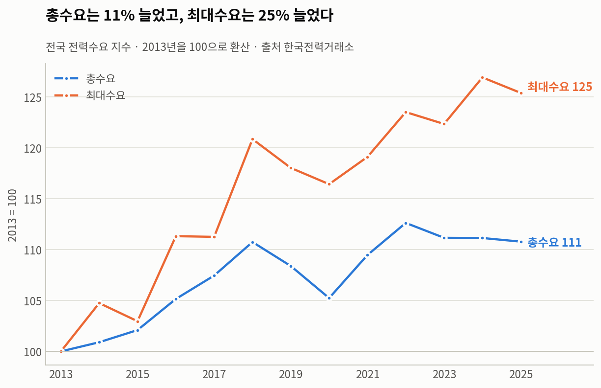

2013년을 100으로 놓으면 2025년 총수요는 **110.8**, 최대수요는 **125.4**다. 피크가
총량보다 **2.4배 빠르게** 자랐다. 특히 2022년 이후 총수요는 574 → 567 → 567 → 565 TWh로
사실상 정체인데, 같은 기간 최대수요는 94.5 → 93.6 → **97.1** → 96.0 GW로 오히려
역대 최고치를 새로 썼다.

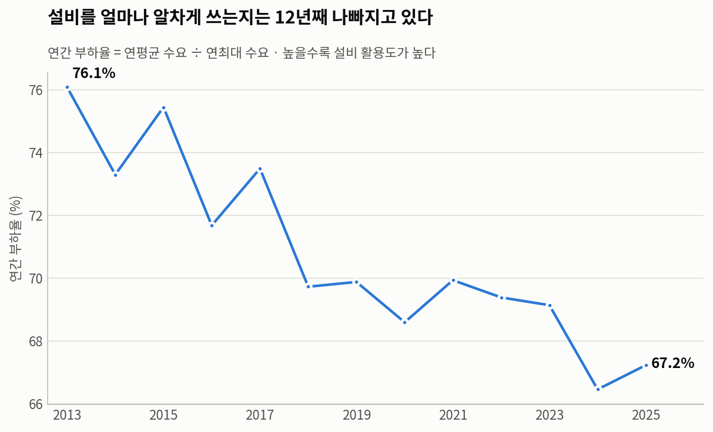

두 지표의 격차는 부하율 하락으로 나타난다. 연간 부하율(연평균 수요 ÷ 연최대 수요)은
**76.1% → 67.2%로 8.9%p 떨어졌고**, 일 단위 부하율도 90.9% → 87.8%로 12년 내내
같은 방향으로 움직였다. 중간에 오르내림은 있으나 추세는 뚜렷하다.

### Q2. 여름과 겨울 중 어느 계절이 더 부담인가 — 2016년에 답이 바뀌었다

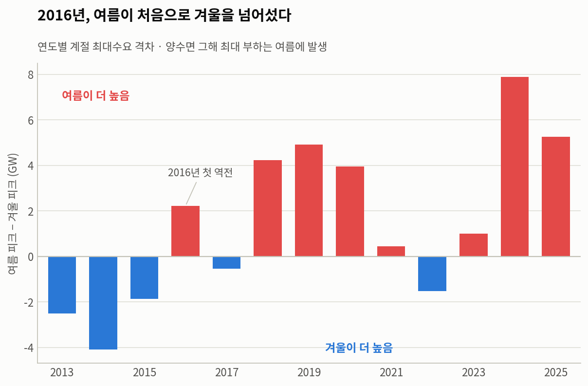

2013~2015년에는 겨울 피크가 더 높았다(2014년 겨울 80.2 vs 여름 76.1GW). **2016년에
처음 역전**됐고, 2018년 이후로는 여름 우위가 굳어졌다. 2024년에는 여름 97.1 vs 겨울
89.2GW로 격차가 **7.9GW**까지 벌어졌다.

역대 최대수요 상위 10개 시간은 전부 2024~2025년 7~8월 오후 4~8시에 몰려 있다.
1위는 **2024-08-20 17시, 97,115 MWh**다.

다만 2022년은 겨울이 다시 앞섰다(여름 93.0 vs 겨울 94.5GW). 추세가 단조롭지 않다는
점은 기록해둔다.

### Q3. 하루 중 피크 시각은 언제인가 — 12년 동안 4시간 밀렸다

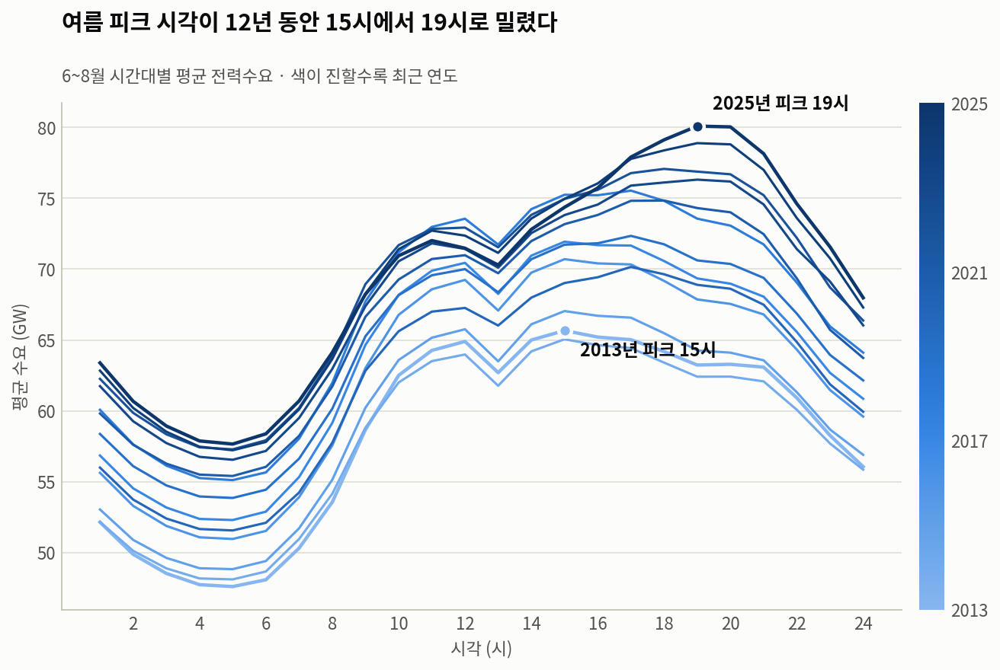

여름철(6~8월) 시간대별 평균 수요의 정점이 계단식으로 이동했다.

| 기간 | 피크 시각 |
|---|---|
| 2013~2017 | 15시 |
| 2018~2020 | 17시 |
| 2021~2022 | 18시 |
| 2023~2025 | **19시** |

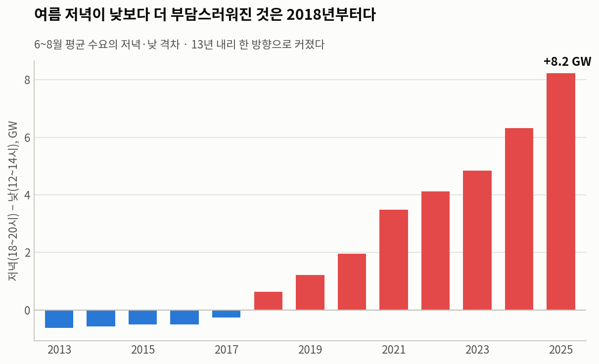

교차 검증으로 여름철 **낮(12~14시) 대비 저녁(18~20시)** 평균 수요차를 계산했더니
13년간 한 번의 예외도 없이 커졌다. −0.63GW(2013) → +0.64(2018) → +3.49(2021) →
+4.84(2023) → **+8.22GW(2025)**. 피크 시각이라는 이산적 지표와 격차라는 연속적 지표가
같은 이야기를 하므로, 이 이동은 특정 연도의 우연이 아니다.

겨울도 2023-24 시즌부터 피크 시각이 10시 → 19시로 바뀌었다. 다만 관측이 2개 시즌뿐이라
아직 추세로 부르기는 이르다.

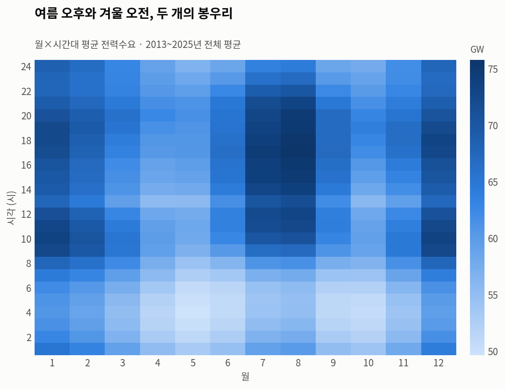

전 기간 평균으로 보면 여름 오후와 겨울 오전이라는 두 개의 봉우리가 보인다. 위의 연도별
분석은 이 중 여름 봉우리가 오른쪽으로 이동해왔다는 이야기다.

### Q4. 기온과 수요의 관계 — 직선이 아니라 U자다

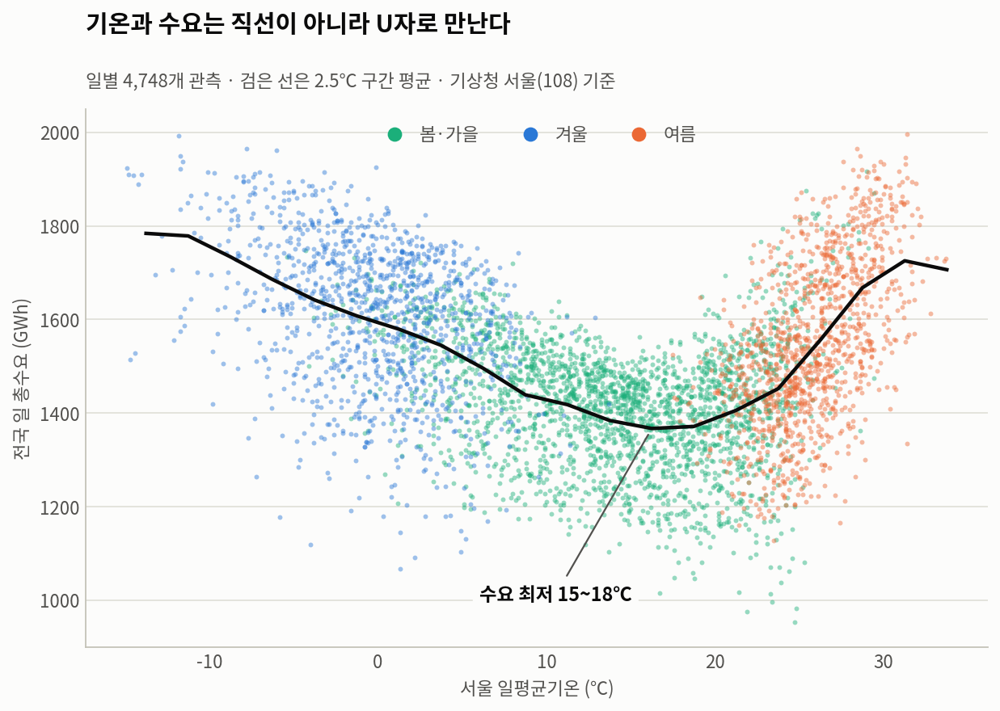

| 일평균기온 | 일수 | 일 총수요 | 일 최대수요 |
|---|---|---|---|
| 영하 | 628 | 1,649 GWh | 76.1 GW |
| 0~10℃ | 1,174 | 1,521 | 69.9 |
| 10~18℃ | 981 | **1,387** | **63.6** |
| 18~24℃ | 974 | 1,407 | 65.6 |
| 24~28℃ | 689 | 1,528 | 72.5 |
| 28℃ 이상 | 302 | **1,691** | **81.6** |

구간은 좌측 폐구간 `[하한, 상한)` 기준이다. 경계값(예: 정확히 28.0℃인 날)을 어느 쪽에
넣느냐에 따라 28℃ 이상 구간 평균이 1,691과 1,695 GWh로 갈리므로 규정을 명시해둔다.

바닥은 10~18℃ 구간이고 양쪽으로 올라간다. 주목할 점은 **28℃ 이상(1,691 GWh)이
영하(1,649 GWh)를 넘어섰다**는 것이다. Q2의 계절 역전과 같은 현상을 기온 축에서
본 셈이다.

여기서 통계적 함정을 하나 기록해둔다. 기온과 수요의 상관계수를 전체 기간으로 계산하면
**−0.191**이 나와 "기온이 오르면 수요가 준다"는 잘못된 결론에 이른다. U자 관계를 직선
하나로 재려 했기 때문이다. 계절을 나누면 방향이 정반대로 갈린다.

| 구간 | 상관계수 |
|---|---|
| 전체 기간 | −0.191 (오해 유발) |
| 여름 (6~8월) | **+0.546** |
| 겨울 (12·1·2월) | **−0.358** |
| CDD ↔ 여름 수요 | +0.547 |
| HDD ↔ 겨울 수요 | +0.358 |

냉방도일·난방도일로 변환하면 둘 다 양(+)의 관계로 정리된다. 비선형 관계는 변환으로
펴야 한다는 것을 보여주는 사례다.

---

## 5. 보너스 — 시계열 분해와 예측

### 5.1 MSTL 분해: 무엇이 이 시계열을 움직이는가

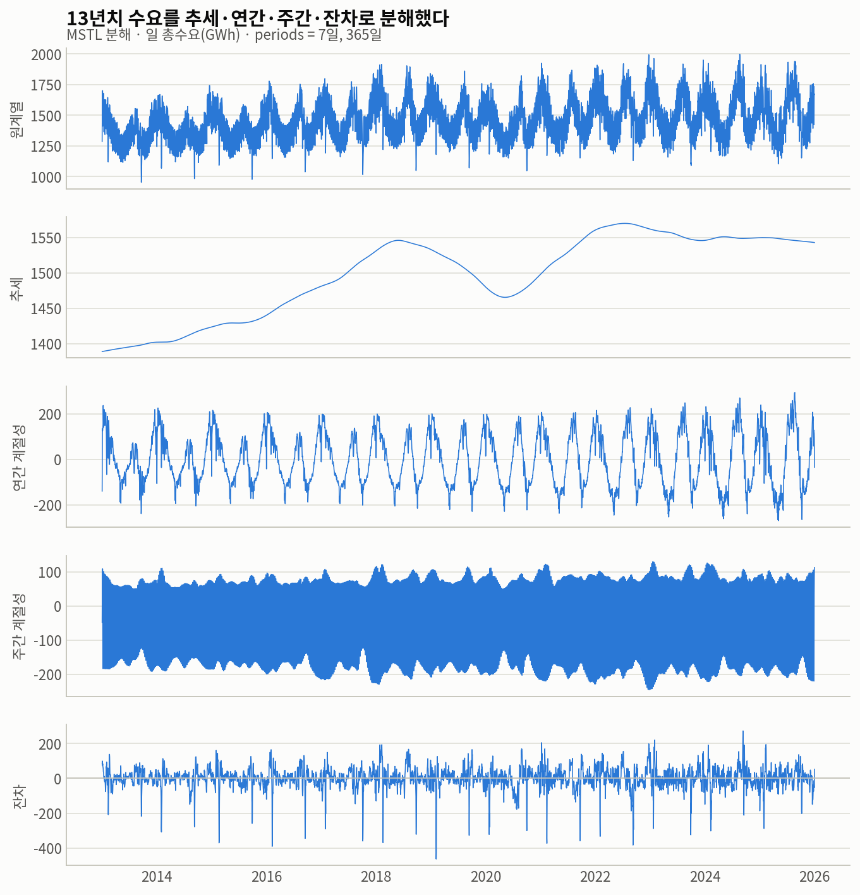

주간(7일)과 연간(365일) 주기를 동시에 분리하기 위해 MSTL을 적용했다. 단일 STL로는
두 주기 중 하나만 잡히기 때문이다.

| 성분 | 분산 기여도 | 규모 |
|---|---|---|
| 연간 계절성 | **44.2%** | 진폭 563 GWh (최대 8월 22일, 최소 5월 6일) |
| 주간 계절성 | **30.9%** | 진폭 375 GWh |
| 추세 | 11.2% | 1,389 → 1,543 GWh |
| 잔차 | 13.7% | 표준편차 63 GWh |

이 데이터의 움직임 중 4분의 3은 계절과 요일이라는 **달력만 알면 예측되는 부분**이다.
추세가 설명하는 몫은 11%에 불과하다. "전기 사용량이 는다/준다"는 뉴스가 대개 계절
효과를 추세로 착각하는 이유가 여기에 있다.

추세 성분은 2018년 정점 → 2020년 저점 → 2022년 재정점 → 이후 완만한 하락의 형태다.
2020년 저점은 코로나19 시기와 겹친다.

### 5.2 잔차가 알려준 것: 남은 오차는 대부분 명절이다

잔차 절댓값 상위 12일을 뽑았더니 **12일 전부가 설날 또는 추석 연휴**였고, 모두
음(−)의 방향이었다.

| 날짜 | 잔차 | 해당 명절 |
|---|---|---|
| 2019-02-05 | −463 GWh | 설날 |
| 2019-02-06 | −428 | 설날 연휴 |
| 2016-02-08 | −391 | 설날 |
| 2022-09-09 | −383 | 추석 |
| 2021-02-12 | −374 | 설날 |
| 2015-02-19 | −371 | 설날 |
| 2018-02-16 | −370 | 설날 |
| 2017-10-04 | −360 | 추석 |
| 2021-09-21 | −359 | 추석 |

음력 명절은 양력 날짜가 매년 달라서 365일 주기 성분으로는 잡히지 않는다. 그래서
분해 모형 입장에서는 설명 불가능한 충격으로 남고, 결과적으로 **잔차가 명절 탐지기
역할**을 하게 됐다. 모형을 개선하려면 음력 달력을 외생 변수로 넣어야 한다는 뜻이다.

### 5.3 베이스라인 예측

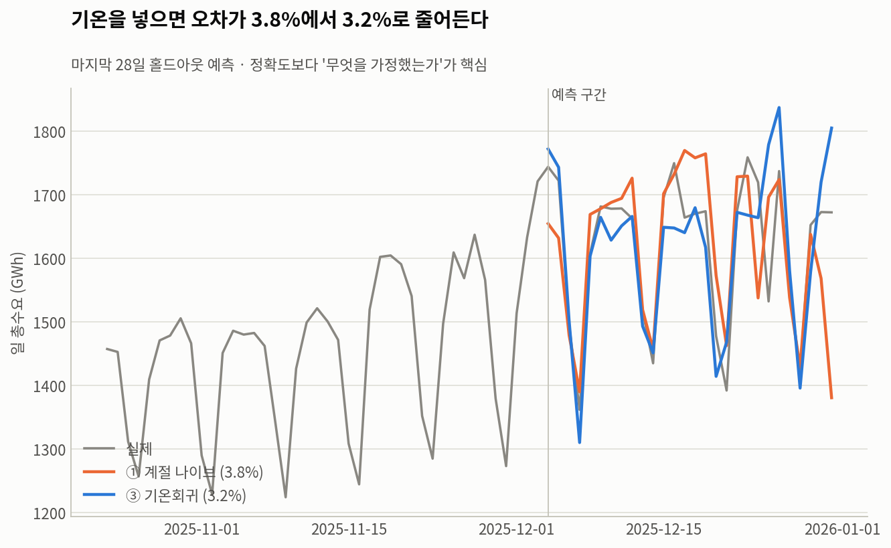

마지막 28일(2025-12-04 ~ 12-31)을 홀드아웃으로 두고 세 가지 베이스라인을 비교했다.

| 방법 | 가정 | MAPE |
|---|---|---|
| ① 계절 나이브 (364일 전) | "작년 같은 요일과 같을 것이다" | 3.83% |
| ② ① + 추세 보정 | "작년 대비 전체 수준만 달라졌을 것이다" | 3.78% |
| ③ 기온회귀 (CDD·HDD + 요일) | "기온과 요일을 알면 수요를 안다" | **3.17%** |

정확도 자체보다 **가정의 차이**가 요점이다. ①은 달력만 본다. ②는 여기에 수준 이동을
더한다. ③은 그해 기온이라는 외부 정보를 쓴다. ①→②의 개선이 0.05%p에 그친 것은
2025년 12월의 수요 수준이 1년 전과 크게 다르지 않았다는 뜻이고, ②→③에서 0.6%p가
줄어든 것은 **그 기간의 오차 상당 부분이 기온 변동에서 왔다**는 뜻이다.

**이 예측의 한계는 명확하다.** ③은 미래 기온을 이미 안다고 가정한 사후 검증이다.
실제 예측에서는 기상 예보의 오차가 그대로 얹히므로 3.17%는 달성 가능한 하한에
가깝다. 또 28일이라는 짧은 창, 그것도 겨울 한 구간만 검증했으므로 여름 폭염 구간에
같은 성능이 나온다는 보장은 없다. 잔차 분석에서 드러났듯 명절 효과도 반영되지 않았다.

### 5.4 인터랙티브 대시보드

기간·집계 단위·지표·계절을 바꿔가며 위 결과를 직접 확인할 수 있는 대시보드를 함께
만들었다. 배포 URL은 두 곳에 올려두었다.

**https://parkhuk20-dot.github.io/codyssey-m1-1/dashboard.html** — GitHub Pages.
로그인이나 계정 없이 누구나 바로 열 수 있다. (권장)

**https://claude.ai/code/artifact/0df2fa95-d2fd-44ae-b31b-f06aba2ae0a8** — Claude
Artifact. 동일한 대시보드지만 Claude 계정 로그인이 필요할 수 있다.

저장소의 `dashboard.html`을 브라우저로 직접 열어도 동일하게 동작한다(데이터가 파일에
포함되어 있어 서버가 필요 없다).

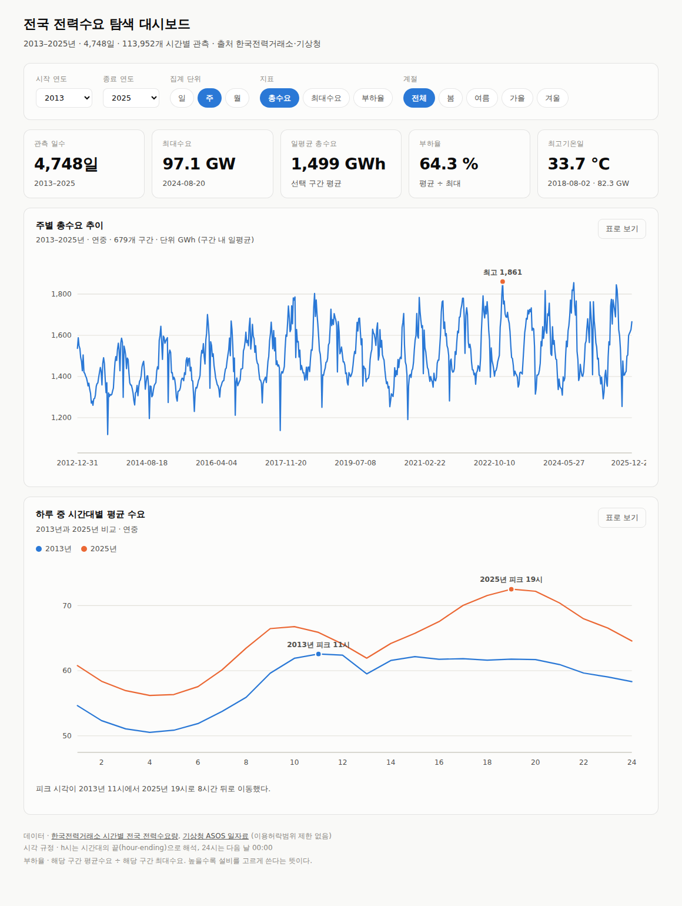

시나리오 예시 — 시작 연도를 2020, 종료 연도를 2025로 좁히고 계절을 '여름',
지표를 '최대수요', 집계 단위를 '월'로 바꾸면, 여름철 최대수요만 월 단위로 추려
보여주며 하단 프로파일이 2020년과 2025년의 시간대별 곡선을 겹쳐 그린다.
이때 피크 시각이 17시에서 19시로 이동했다는 문장이 자동으로 갱신된다.

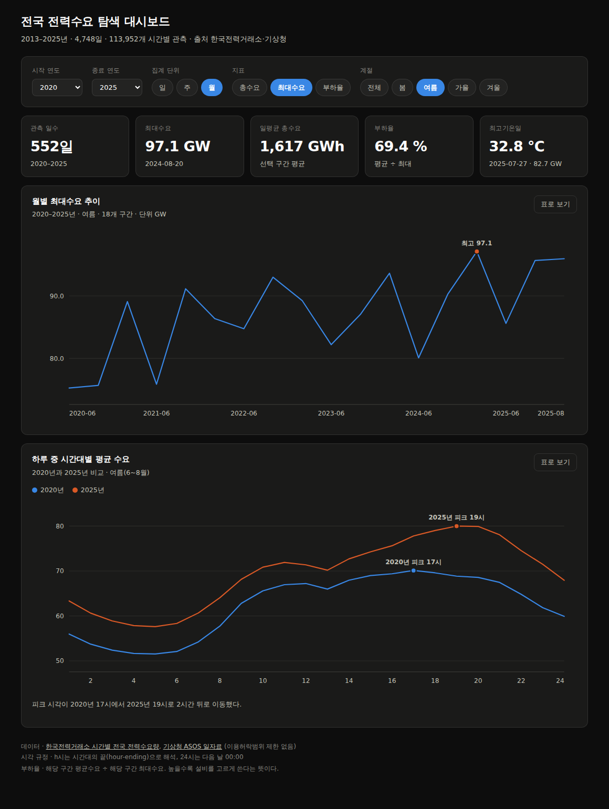

각 차트는 '표로 보기' 토글로 원본 수치를 확인할 수 있다. 그래프를 읽지 못하는
경우에도 값에 접근할 수 있어야 한다는 판단이다.

---

## 6. 인사이트

각 인사이트는 **관찰(Fact)** — 데이터에서 직접 계산된 수치, **해석(Hypothesis)** — 그
수치의 원인에 대한 가설과 반증 가능성, **행동(Action)** — 다음에 할 일로 구분해 적는다.

### 인사이트 1 — 문제는 총량이 아니라 피크다

**관찰.** 2013→2025년 총수요는 +10.8%, 최대수요는 +25.4% 증가했다. 연간 부하율은
76.1% → 67.2%로 8.9%p 하락했다. 2022년 이후 총수요는 정체(574→565 TWh)인 반면
최대수요는 2024년 97.1GW로 역대 최고를 기록했다.

**해석.** 부하율 하락은 설비 투자 대비 회수 효율이 나빠진다는 뜻이다. 1년에 몇 시간
쓰자고 발전·송전 설비를 짓게 되기 때문이다. 원인 가설로는 (a) 냉난방 전기화로 기온에
민감한 부하 비중이 커진 것, (b) 산업용 대비 가정·상업용 비중 변화, (c) 태양광 보급으로
계통이 마주하는 순부하의 변동폭이 커진 것을 생각할 수 있다. 이 데이터만으로는 셋을
구분할 수 없다. 다만 (a)는 Q4의 기온-수요 U자 관계와, (c)는 인사이트 3과 정합적이다.

**행동.** 총수요 통계만 보는 관행에서 벗어나 부하율을 함께 봐야 한다. 정책 관점에서는
총량 절감보다 **피크 시간대 이동**의 가치가 더 크다는 근거가 된다.

### 인사이트 2 — "겨울 난방 피크"는 10년 전 상식이다

**관찰.** 2016년 여름 피크(85.2GW)가 처음으로 겨울(83.0GW)을 넘어섰고, 2018년 이후
여름 우위가 굳어졌다. 2024년 격차는 7.9GW다. 역대 최대수요 상위 10개 시간은 전부
2024~2025년 7~8월 오후다. 기온 축에서도 28℃ 이상 구간(1,691 GWh)이 영하 구간
(1,649 GWh)을 앞섰다.

**해석.** 난방은 가스·등유 등 대체 연료가 있지만 냉방은 사실상 전기 단일 수단이라는
점이 기본 가설이다. 여기에 여름철 고온 일수 증가와 에어컨 보급률 상승이 겹쳤을 것이다.
**반례가 있다.** 2022년에는 겨울이 다시 앞섰다(94.5 vs 93.0GW). 추세는 있으나
단조롭지 않으며, 개별 연도는 그해 날씨에 크게 좌우된다.

**행동.** 수급 대책의 무게중심을 여름으로 옮겨야 한다. 다만 겨울 피크도 절대 수준은
계속 오르고 있어 겨울 대비를 줄이자는 뜻은 아니다.

### 인사이트 3 — 계통이 힘든 시각이 오후 3시에서 저녁 7시로 옮겨갔다

**관찰.** 여름철 피크 시각이 15시(2013~17) → 17시(2018~20) → 18시(2021~22) →
19시(2023~25)로 이동했다. 여름철 저녁(18~20시) − 낮(12~14시) 평균 수요차는
−0.63GW(2013)에서 +8.22GW(2025)로 13년 연속 한 방향으로 커졌다.

**해석.** 가장 유력한 가설은 태양광이다. 낮 시간 태양광 발전이 계통이 마주하는
순부하의 낮 봉우리를 깎아내고, 태양광 출력이 사라지는 일몰 무렵으로 피크가 밀리는
이른바 **덕커브(duck curve)** 현상이다. 이동 시기가 국내 태양광 보급 확대기와 겹친다는
점도 이 가설을 지지한다.

**반증 가능성과 검증 과제.** 재택근무 확산이나 산업 조업시간 변화로도 유사한 형태가
나올 수 있다. 무엇보다 **본 데이터가 태양광 발전을 차감한 계통 수요인지, 자가소비를
포함한 총수요인지 확인되지 않았다.** 제공기관 설명은 "수요예측 목적의 발전단 기준
잠정치"라고만 밝히고 있다. 만약 이 값이 태양광을 포함한 총수요라면 덕커브 가설은
성립하지 않으며 다른 설명을 찾아야 한다. **이 확인 없이는 해석을 확정할 수 없다.**

**행동.** 한국전력거래소에 데이터 정의를 문의해 태양광 차감 여부를 확정하는 것이
최우선이다. 함께 수집한 일사량(sumGsr) 데이터로 "일사량이 높은 날일수록 낮 수요가
더 깎이는가"를 검정하면 간접 검증이 가능하다. 실무적으로는 "밤에 쓰면 계통에 도움이
된다"는 통념이 이미 낡았음을 시사한다. 최근 데이터 기준으로 계통이 가장 여유로운
시간은 심야가 아니라 **여름 낮 시간대**일 수 있다.

### 인사이트 4 — 하나의 상관계수는 사람을 속인다

**관찰.** 기온과 일 총수요의 상관계수는 전체 기간 −0.191이지만, 여름은 +0.546,
겨울은 −0.358로 방향이 정반대다. 수요 최저 구간은 10~18℃(1,387 GWh)이며 양쪽으로
증가한다. CDD·HDD로 변환하면 각각 +0.547, +0.358로 모두 양의 관계가 된다.

**해석.** 원인은 현상이 아니라 방법에 있다. 직선 상관계수는 U자 관계를 측정하지
못한다. 전체 기간 −0.191이라는 수치는 겨울 구간의 관측 수가 여름보다 많아 음의 기울기가
평균을 지배한 결과일 뿐이다.

**행동.** 비선형이 의심되면 상관계수를 계산하기 전에 산점도부터 그린다. 도메인 지식으로
구간을 나누거나(계절 분리), 관계를 펴는 변환(CDD·HDD)을 적용한 뒤 계산한다.

---

## 7. 결론 및 한계점

### 결론

13년치 시간별 전력수요를 분석한 결과, 이 시계열의 이야기는 "얼마나 쓰는가"가 아니라
**"언제 몰려 쓰는가"** 쪽에 있었다.

총수요는 2022년 이후 사실상 정체됐지만 최대수요는 계속 최고치를 경신했고, 그 결과
부하율은 12년 내내 나빠졌다. 계절 축에서는 2016년을 기점으로 부담의 중심이 겨울에서
여름으로 넘어갔다. 하루 축에서는 여름 피크 시각이 오후 3시에서 저녁 7시로 4시간
이동했으며, 이 이동은 13년간 단 한 번의 역행도 없이 진행됐다. 기온과의 관계는 U자였고,
28℃ 이상 구간의 수요가 영하 구간을 넘어섰다.

분해 결과 이 시계열 변동의 75%는 연간·주간 계절성이 설명하며 추세의 몫은 11%에
불과했다. 남은 잔차의 가장 큰 값들은 예외 없이 음력 명절이었다.

### 한계점

**1. 데이터 정의가 확인되지 않았다.** 가장 큰 한계다. 본 데이터가 태양광 발전을 차감한
계통 수요인지 총수요인지에 따라 인사이트 3의 해석이 성립하기도 하고 무너지기도 한다.
제공기관 설명은 "수요예측 목적의 발전단 기준 잠정치"로만 되어 있다.

**2. 지역 불일치.** 전력수요는 전국 합계인데 기온은 서울 1개 지점이다. 서울 기온을
전국 대리변수로 쓴 것은 편의를 위한 선택이며, 실제로는 지역별 기온 가중평균이 옳다.
여름철 남부 폭염이 서울 기온에 덜 반영되는 만큼 Q4의 상관계수는 과소추정일 수 있다.

**3. 외부 변수 미반영.** 전기요금 개편, 산업 구조 변화, 코로나19, 수요반응(DR) 제도,
전기차 보급 등이 모두 이 기간에 작용했으나 어느 것도 모형에 넣지 않았다. 추세 성분의
2020년 저점을 코로나로 해석한 것도 시점 일치에 근거한 추정일 뿐이다.

**4. 상관은 인과가 아니다.** 기온과 수요의 상관이 높다고 기온이 수요를 결정한다고
말할 수 없다. 냉방기기 보급률처럼 관측되지 않은 변수가 함께 움직였을 수 있다.

**5. 명절 미반영.** 잔차 분석에서 명절이 최대 오차 요인으로 드러났으나, 시간 관계상
음력 달력을 모형에 넣지는 못했다.

**6. 예측 검증 구간이 좁다.** 28일, 그것도 겨울 한 구간만 검증했다. 여름 폭염 구간에서
같은 성능이 나온다는 근거는 없다.

### 다음에 할 일

1. 한국전력거래소에 데이터 정의 문의 — 태양광 차감 여부 확정 (최우선)
2. 함께 수집한 일사량 데이터로 덕커브 가설 간접 검정
3. 지역별 기온 가중평균으로 Q4 재계산
4. 음력 명절을 외생 변수로 추가해 잔차 재분석

---

## 8. AI 사용 로그

본 분석은 Claude(Anthropic)를 활용해 수행했다. 투명성을 위해 사용 내역과 검증 방법을
기록한다.

### 8.1 사용한 작업

| 단계 | AI 사용 여부 | 구체적 내용 |
|---|---|---|
| 주제 선정 | 보조 | 후보 주제를 제안받고 최종 선택은 직접. 전력 도메인을 택한 이유(파이널 프로젝트 연계, 계절성 다중 구조)는 필자 판단 |
| 데이터 수집 | 전면 | 공공데이터포털 탐색, CSV 6개 다운로드, ASOS OpenAPI 13회 호출 및 CSV 변환 |
| 전처리 | 전면 | EUC-KR 디코딩, wide→long 변환, 결측·중복·시간축 검사 스크립트 작성 |
| 탐색 분석 | 전면 | 집계·상관·분해 코드 작성 및 실행 |
| 시각화 | 전면 | matplotlib 코드 작성, 색상 팔레트 선정 및 접근성 검증 |
| 해석 | 보조 | AI가 가설을 제시하고 필자가 도메인 지식으로 취사선택. 덕커브 가설의 채택과 "데이터 정의 확인 필요"라는 유보 조건은 필자 판단 |
| 문장 다듬기 | 전면 | 리포트 서술 |

### 8.2 사용한 이유

**시간 절감.** 113,952행 전처리와 9종 시각화를 수작업으로 하면 며칠이 걸린다. 절감한
시간을 "이 수치가 무슨 의미인가"를 따지는 데 썼다.

**대안 탐색.** 단일 STL 대신 MSTL, 평균·표준편차 대신 중앙값·MAD, 원시 기온 대신
CDD·HDD 등 여러 방법을 빠르게 비교할 수 있었다. 혼자였다면 첫 번째로 떠오른 방법
하나만 썼을 것이다.

**검증.** 손으로 계산하기 번거로운 교차 검증(같은 결론을 다른 지표로 재확인)을
반복 수행할 수 있었다.

### 8.3 검증 방법

**재현.** 모든 수치는 `src/` 스크립트를 다시 실행하면 그대로 재생산된다. 리포트에 쓴
숫자 중 스크립트 출력에 없는 것은 없다.

**교차 검증.** 핵심 주장은 서로 다른 지표 두 개로 확인했다. 예를 들어 Q3의 피크 이동은
(a) 연도별 피크 시각이라는 이산 지표와 (b) 저녁−낮 격차라는 연속 지표로 각각 확인했고
두 결과가 일치했다. Q2의 계절 역전도 (a) 계절별 최대수요 비교와 (b) 기온 구간별 수요
집계라는 다른 경로로 같은 결론에 도달했다.

**샘플링 체크.** 전처리 결과를 원본 CSV와 대조했다. 예를 들어 2025-01-01 1시 값이
원본 62,256 MWh와 변환 후 값이 일치하는지 확인했다.

**AI 주장의 기각 사례.** 초기에 AI가 겨울 피크 시각이 10시에서 19시로 바뀌었다는
결과를 제시했으나, 확인 결과 12월(t년)과 1·2월(t년)을 한 그룹으로 묶어 **서로 다른
겨울을 섞은** 계산이었다. 겨울 시즌 기준(12월 t년 + 1·2월 t+1년)으로 재계산해 바로잡았고,
관측이 2개 시즌뿐이라 추세로 단정하지 않기로 했다.

**의도적 유보.** 덕커브 가설은 그럴듯하지만 데이터 정의가 확인되지 않아 확정하지 않았다.
AI가 제시한 설명을 그대로 채택하지 않고 검증 조건을 명시하는 것이 이 리포트의 원칙이다.

---

## 9. 재현 방법

### 폴더 구조

```
M1-1/
├── data/
│   ├── DATA_SOURCE.md            출처·수집방법·라이선스·결측처리 규정
│   ├── raw/                      원본 (전력수요 6 + 기상 1)
│   └── processed/                정제 결과
├── images/                       시각화 9종
├── src/
│   ├── viz_style.py              공통 차트 스타일·팔레트
│   ├── 01_preprocess.py          전력수요 병합·정제
│   ├── 02_merge_weather.py       기상 결합
│   ├── 03_visualize.py           시각화 1~7
│   ├── 04_decompose_forecast.py  MSTL 분해 + 예측
│   └── collect_asos.js           ASOS 수집 스크립트
├── QUESTIONS.md                  분석 질문 정의
├── REPORT.md                     본 문서
├── requirements.txt
└── .env.example                  API 키 형식 (실제 키는 .env, gitignore 대상)
```

### 실행

```bash
pip install -r requirements.txt

python src/01_preprocess.py          # 원본 6개 -> demand_hourly / demand_daily
python src/02_merge_weather.py       # 기상 결합 -> daily_merged
python src/03_visualize.py           # images/01~07
python src/04_decompose_forecast.py  # images/08~09
```

순서대로 실행해야 한다. 각 스크립트는 앞 단계의 출력을 입력으로 쓴다.

기상 데이터를 새로 수집하려면 [공공데이터포털](https://www.data.go.kr/data/15059093/openapi.do)에서
ASOS 일자료 서비스 활용신청(자동승인) 후 발급받은 인증키를 `.env`의 `KMA_API_KEY`에
넣는다. 승인 직후에는 키가 API 서버에 전파되기까지 1시간가량 걸리므로 그 사이 호출하면
`SERVICE_KEY_IS_NOT_REGISTERED_ERROR`가 발생한다.

### 실행 환경

Python 3.10.12 / pandas 2.3.3 / numpy / matplotlib 3.10.9 / statsmodels 0.15.0

한글 렌더링을 위해 `Noto Sans CJK` 계열 폰트가 필요하다. 다른 환경에서는
`src/viz_style.py`의 `font.family`를 해당 시스템의 한글 폰트(예: `AppleGothic`,
`Malgun Gothic`, `NanumGothic`)로 바꾼다.

### 데이터 라이선스

전력수요·기상 데이터 모두 공공데이터포털 제공분으로 이용허락범위 제한이 없으며 무료다.
단, ASOS API 인증키는 개인 발급분이므로 저장소에 포함하지 않았다.
